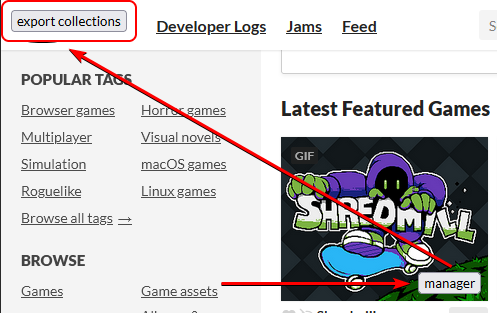

## Update

This UserScript was just a prototype to test out the idea. Unfortunately, indexeddb and other local browser storage api cannot be shared between domains/subdomains. Since individual game pages exist on subdomains of itch.io, this becomes a bit of a problem. There are some potential workarounds, but they aren't easy to build, and each of them come with their own extra problems. Therefore, I decided to start working on a full blown browser extension, instead. An extension can create storage on its own internal domain and allow content scripts on other pages to communicate and access storage via a background script/worker.

In order to keep your collections while switching over to the extension, I've added a popup manager with an "export" button. You can show the popup by clicking any of the buttons with the text "manager" on top of any game cell:

This should prompt a download of a `collections_database.json` file, which will contain all your collections data. The extension will have a similar popup manager with an "import" button for importing this data.

If you have any problems with transferring your data, please submit an issue in this repository, and I will try to help you out.

The browser extension version:

- https://github.com/ericchase/browserextension--improved-itch.io-collections-manager

## About

https://github.com/ericchase/browseruserscript--itch.io

A UserScript for injecting a better Collections system on https://itch.io/.

- [Static Listing](https://ericchase.github.io/browseruserscript--itch.io/)

For more information, please check out the template project:

- https://github.com/ericchase-library/ts-templates-browser-userscript

## Build Tools V4

For information about my TypeScript library and Build Tools, please visit:

- https://github.com/ericchase-library/ts-library

## Copyright & License

**TL;DR:**

> This code is truly free and open source, licensed under the Apache 2.0 License. If you make a copy, _I humbly ask_ that you include the text from the `NOTICE` file somewhere in your project. **_You are not required to!_** You are also not required to include the original `LICENSE-APACHE` or `NOTICE` files, and I would prefer just a copy of the `NOTICE` file text or a link to this repository instead. You can use and modify this code however you like, including using a proprietary license for your changes. The only restriction I maintain is under clause 3 of the Apache 2.0 License regarding patents. If you find any potential license violations within any of my projects, please contact me so that I may resolve them.

A longer explanation can be found in the `README.md` file at https://github.com/ericchase-library/ts-library.
